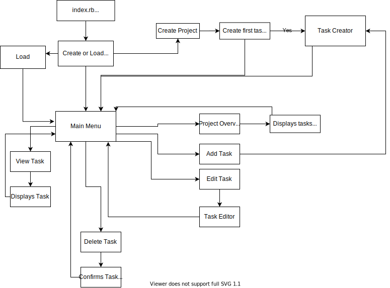

# Terminal Based Project Manager

Terminal Based Project Manager is a powerful, lightweight, easy to use text based project manager.

### Git Repository

https://github.com/philthehuman/TBPM

### Source Attributions

#### Gems Used

https://github.com/prawnpdf/prawn - PDF Creation

https://github.com/piotrmurach/tty-prompt - Terminal Option Selection

https://github.com/piotrmurach/tty-table - Terminal Tables

https://github.com/sickill/rainbow- Colour Terminal Text

https://ruby-doc.org/stdlib-2.5.3/libdoc/yaml/rdoc/YAML.html - YAML Module


# Software Development Plan

### What is Terminal Based Project Manager?

TBPM allows users to plan out their projects. It will allow users to create tasks under three default headers: To Do, In Progress and Done. These headers will be customise-able and can be expanded on. Tasks are able to be created, deleted, changed from one 'header' to another and have their contents edited. Tasks will have attributes assigned to them such as Title, description, due date, priority, tags, comments and checklist.

Users will be able to see a timeline of their project, which will show which tasks need to be done in chronological order. They will be able to select different tasks to see their expanded details.

Users will also be able to generate a PDF containing a full overview of all headers, along with their expanded tasks. This PDF will be customise-able (you can show all or some headers and you can collapse or expand tasks).

Data will be stored in a YAML file so that all user data is saved between sessions. This will also allow users to transport their projects between computers. Users could potentially store the YAML file on a service like Google Drive or Dropbox and edit it from anywhere they can access a ruby terminal.

### Why use Terminal Based Project Manager?

When starting a project, time management and task breakdown is of upmost importance. TBPM allows users a super simple and quick way of organising a project and then viewing their tasks at a glance. Don't want to input all of your data via the command line? TBPM includes instructions on entering all your data directly into a YAML file which makes creation of implementation plans fast and easy. If bulky GUI based project managers aren't your style, TBPM is just the thing you need.

### Who is Terminal Based Project Manager for?

TBPM is aimed at anyone who wants a quick and easy way to organise their projects.

It can be used for people looking to manage:

- Software development
- Business planning
- Uni/Schoolwork
- Life tasks and goals

This is just a small range of possible applications, your imagination is the limit. TBPM is useful for any tasks that require planning.

### How do I use Terminal Based Project Manager?

When you start TBPM it prompts you to load a YAML file containing all of your project data.

If you have not already created a project, you can either create one by inputting data directly into a YAML file (a template and instructions on how to do this will be included) or by following in-terminal prompts to set up an initial project (which will save it's data to a YAML file for use on next load). Different YAML files essentially act as different projects. For instance, if you're a University student, you could use a YAML file named uni.yml to manage all your study requirements and assignment due dates for all your classes. You could have another YAML file for a Uni assignment named CS01A1.yml which would include a breakdown of all the tasks you need to complete (along with a timeline) to finish the assignment.

Once you have a project set up, on launch you can load it up with an argument that includes the name of the YAML file. This will skip any setup process and jump straight into the project itself. The below would load the user's Uni project at launch.

```
$ ruby tbpm.rb load uni.yml
```

You will now be able to see the main overview of your project which contains all headers, with their related tasks. You will be able to select different tasks to expand and modify them (including which header they are under). You can also select different headers to add tasks.

You will also be able to generate a PDF document that contains your tasks in a range of different configurations. For example, you could generate one of all your headers with their tasks collapsed or expanded. This would be useful if for instance you wanted a print out of all your tasks in your "In Progress" header with a detailed list of all tasks. This feature could be used purely through arguments eg. 

```
$ ruby tbpm.rb pdf CS01A1.yml "In Progess" expanded
```


### What features does Terminal Based Project Manager include? ###

**Project Creation**

TBPM includes an in terminal project creation walk-through. This requests all the needed input to start a project, such as headings, tasks and task details. The user inputs the required information line by line and is asked if they want to include additional information when appropriate. For example, when a user has created a task with a Title, they are asked if they wish to include further information such as a description, due date, priority etc. The project could be as complex or simple as the user wants it to be.

A project can include as many headers as desired. Headers can contain as many tasks as desired.

Tasks contain the following attributes/features:

- Title (required)
- Description
- Due Date
- Checklist
- Priority
- Tags
- Dated comments

**Project Viewing and Editing**

When a user loads an existing YAML file, the user can see the project and has various modes of viewing, such as expanded and collapsed Task view, chronological view (shows all task due dates and orders them chronologically) and priority view (shows all tasks' priorities and orders them by priority). The user can also select different headers and tasks which they can edit or view more information on.

The project viewer will also include a filter which allows users to view all tasks with specific tags or priorities.

**Project PDF generation**

The PDF generation feature allows the user to create a PDF (intended for printing or sharing). The user can filter their project as desired. For example a user can generate a PDF that only contains tasks from the "To Do" header. The user will also be able to decide whether the tasks are displayed as expanded (showing all their attributes), partially expanded (showing only select attributes) or collapsed. A user could also filter the tasks displayed on their generated PDF via tags or priority. The user can also decide what order the Tasks will be displayed (chronologically or priority based). The PDF can also be generated with attributes at launch.

### UX - How will the user interact with the program?

**Learning the App**

One of the goals of this project is to make the app as intuitive to use as possible. The user should be able to use the program without having to have any outside help. Given the amount of features in the app, a help guide markdown file (user_manual.md) will be included with the program which will walk users though all of the app's features and how to use them. The guide will also include setup instructions, which will guide them through installing ruby and the GEMs required to run the program.

**Interacting with the App**

The user will interact with the program mainly through a series of selection menus. When there are lots of items in the selection menus, a menu search will be enabled which allows the user to shortlist the menu items by typing in letters corresponding to the menu item names.

The user will also be prompted to input information. This information will be validated when needed (using  RegEx) and parsed in the case of Time input.

The Project overview and Project Tasks will be displayed to the user via plain text. This text will be enhanced with the use of unicode tables and text styling (such as text colour and underlines).

### Workflow Diagram

**Simplified Workflow Diagram of App**



### Implementation Plan

You can view the Implementation Plan [here](https://trello.com/b/D16Bl7u9/tbpm-app)

### Help Documentation

A document titled user_manual.md is included in the root folder.